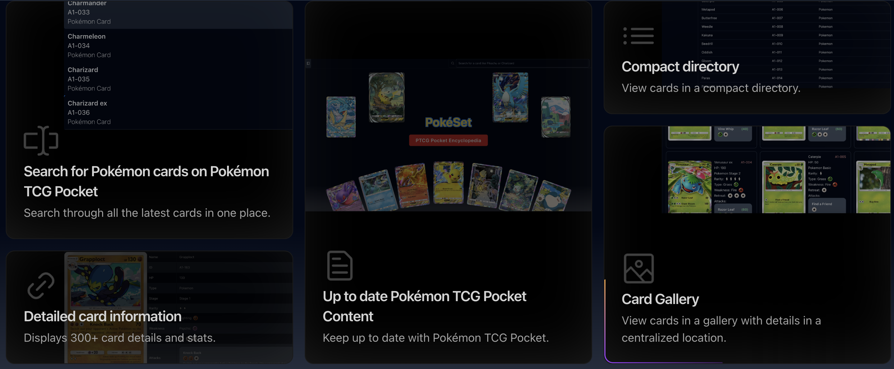

<!-- Improved compatibility of back to top link: See: https://github.com/othneildrew/Best-README-Template/pull/73 -->

<a name="readme-top"></a>

<!-- PROJECT SHIELDS -->
<!--
*** I'm using markdown "reference style" links for readability.
*** Reference links are enclosed in brackets [ ] instead of parentheses ( ).
*** See the bottom of this document for the declaration of the reference variables
*** for contributors-url, forks-url, etc. This is an optional, concise syntax you may use.
*** https://www.markdownguide.org/basic-syntax/#reference-style-links
-->

<!-- [![Contributors][contributors-shield]][contributors-url] -->
<!-- [![Forks][forks-shield]][forks-url] -->
<!-- [![Stargazers][stars-shield]][stars-url] -->
<!-- [![Issues][issues-shield]][issues-url] -->

[![MIT License][license-shield]][license-url]
[![LinkedIn][linkedin-shield]][linkedin-url]

<!-- PROJECT LOGO -->
<br />
<div align="center">
  <a href="https://rune-it-back.onrender.com">
    
  </a>

  <h3 align="center">Pokèset</h3>

  <p align="center">
    An online encyclopedia dedicated to the Pokèmon Trading Card Game Pocket game. With over 319 cards details and images, Pokèset is a centralized location to get PTCGP resources.
    <br />
    <a href="https://pokeset.onrender.com/">View Demo</a>

  </p>
</div>

<!-- TABLE OF CONTENTS -->
<details>
  <summary>Table of Contents</summary>
  <ol>
    <li>
      <a href="#about-the-project">About The Project</a>
      <ul>
        <li><a href="#built-with">Built With</a></li>
      </ul>
    </li>
    <li>
      <a href="#getting-started">Getting Started</a>
    </li>
    <li><a href="#usage">Usage</a></li>
    <li><a href="#features">Features</a></li>
    <li><a href="#roadmap">Roadmap</a></li>
    <li><a href="#license">License</a></li>
    <li><a href="#contact">Contact</a></li>
    <li><a href="#acknowledgments">Acknowledgments</a></li>
  </ol>
</details>

<!-- ABOUT THE PROJECT -->

## About The Project

[![Product Name Screen Shot][product-screenshot]](https://rune-it-back.onrender.com)

Pokèset

    An online encyclopedia dedicated to the Pokèmon Trading Card Game Pocket game. With over 319 cards details and images, Pokèset is a centralized location to get PTCGP resources.

<p align="right">(<a href="#readme-top">back to top</a>)</p>

### Built With

Backend

```
- Spring Boot
- Maven
- OAuth
```

Frontend

```
- React
- TailwindCSS
- Vite
```

Tools

```
- MongoDB
- Docker
- Playwright
```

<p align="right">(<a href="#readme-top">back to top</a>)</p>

<!-- GETTING STARTED -->

## Getting Started

Visit the live site at https://pokeset.onrender.com/

<p align="right">(<a href="#readme-top">back to top</a>)</p>

<!-- USAGE EXAMPLES -->

## Usage

Use the sidebar to navigate through the gallery, directory, or to select a random card to view details of. You can also search for a card using the searchbar located in the top right sector.

## Features

- Use [Card Gallery](https://pokeset.onrender.com/cards) to view all available cards on Pokèmon TCG Pocket with selected details.

  - Grid-based layout of all 319+ cards
  - High-quality card images
  - Quick preview of card details

  [![gallery][card-gallery]](https://pokeset.onrender.com/cards)

- View a compact [Card List](https://pokeset.onrender.com/cardslist) to have a simplified view of all cards available on Pokèmon TCG Pocket.

  - Compact, scannable list format
  - Essential card information

    [![list][card-list]](https://pokeset.onrender.com/cardslist)

- [Detailed Cards](https://pokeset.onrender.com/cards/A1-057) to view all data on a singular card.

  - Complete card statistics and information
  - High-resolution card images
  - Card type and rarity details
  - Move and ability descriptions

  [![Detailed Cards][card-details]](https://pokeset.onrender.com/cards/A1-057)

- [Search][card-search] and sidebar navigation to find the card you want.

  - Search by card name
  - Responsive sidebar
  - Quick access menu

  ![Search][card-search]

<p align="right">(<a href="#readme-top">back to top</a>)</p>

### Best Practices

1. Component-based architecture
2. Clean code principles
3. Consistent error handling
4. Performance optimization
5. Accessibility standards

<!-- ROADMAP -->

## Roadmap

- [x] Card Gallery Implementation
- [x] Authentication System
- [x] Search Functionality
- [ ] Deck Builder
- [ ] User Collections
- [ ] Community Features
- [ ] Card Trading System

<p align="right">(<a href="#readme-top">back to top</a>)</p>

<!-- LICENSE -->

## License

Distributed under the MIT License. See `LICENSE.txt` for more information.

<p align="right">(<a href="#readme-top">back to top</a>)</p>

<!-- CONTACT -->

## Contact

Alex Wong

[LinkedIn](https://www.linkedin.com/in/alwong191/)
</br>
[Porftolio](https://alexswe.com/)
</br>
[Github](https://github.com/AlexDoes)

Project Link: [https://github.com/AlexDoes/Pokeset](https://pokeset.onrender.com/)

<p align="right">(<a href="#readme-top">back to top</a>)</p>

<!-- ACKNOWLEDGMENTS -->

## Acknowledgments

<!-- - [Choose an Open Source License](https://choosealicense.com) -->
<!-- - [GitHub Emoji Cheat Sheet](https://www.webpagefx.com/tools/emoji-cheat-sheet) -->
<!-- - [Malven's Flexbox Cheatsheet](https://flexbox.malven.co/) -->
<!-- - [Malven's Grid Cheatsheet](https://grid.malven.co/) -->

- [Img Shields](https://shields.io)
<!-- - [GitHub Pages](https://pages.github.com)
- [Font Awesome](https://fontawesome.com)
- [React Icons](https://react-icons.github.io/react-icons/search) -->

<p align="right">(<a href="#readme-top">back to top</a>)</p>

<!-- MARKDOWN LINKS & IMAGES -->
<!-- https://www.markdownguide.org/basic-syntax/#reference-style-links -->

[product-screenshot]: /Client/frontend/public/bento/cardHome.png
[contributors-shield]: https://img.shields.io/github/contributors/othneildrew/Best-README-Template.svg?style=for-the-badge
[contributors-url]: https://github.com/othneildrew/Best-README-Template/graphs/contributors
[forks-shield]: https://img.shields.io/github/forks/othneildrew/Best-README-Template.svg?style=for-the-badge
[forks-url]: https://github.com/othneildrew/Best-README-Template/network/members
[stars-shield]: https://img.shields.io/github/stars/othneildrew/Best-README-Template.svg?style=for-the-badge
[stars-url]: https://github.com/othneildrew/Best-README-Template/stargazers
[issues-shield]: https://img.shields.io/github/issues/othneildrew/Best-README-Template.svg?style=for-the-badge
[issues-url]: https://github.com/othneildrew/Best-README-Template/issues
[license-shield]: https://img.shields.io/github/license/othneildrew/Best-README-Template.svg?style=for-the-badge
[license-url]: https://github.com/othneildrew/Best-README-Template/blob/master/LICENSE.txt
[linkedin-shield]: https://img.shields.io/badge/-LinkedIn-black.svg?style=for-the-badge&logo=linkedin&colorB=555
[linkedin-url]: https://linkedin.com/in/alwong191/
[card-gallery]: Client/frontend/public/bento/cardGallery.png
[card-list]: Client/frontend/public/bento/cardDirectory.png
[card-search]: Client/frontend/public/bento/cardSearch.png
[card-details]: Client/frontend/public/bento/cardDetails.png
[Next.js]: https://img.shields.io/badge/next.js-000000?style=for-the-badge&logo=nextdotjs&logoColor=white
[Next-url]: https://nextjs.org/
[React.js]: https://img.shields.io/badge/React-20232A?style=for-the-badge&logo=react&logoColor=61DAFB
[React-url]: https://reactjs.org/
[Vue.js]: https://img.shields.io/badge/Vue.js-35495E?style=for-the-badge&logo=vuedotjs&logoColor=4FC08D
[Vue-url]: https://vuejs.org/
[Angular.io]: https://img.shields.io/badge/Angular-DD0031?style=for-the-badge&logo=angular&logoColor=white
[Angular-url]: https://angular.io/
[Svelte.dev]: https://img.shields.io/badge/Svelte-4A4A55?style=for-the-badge&logo=svelte&logoColor=FF3E00
[Svelte-url]: https://svelte.dev/
[Laravel.com]: https://img.shields.io/badge/Laravel-FF2D20?style=for-the-badge&logo=laravel&logoColor=white
[Laravel-url]: https://laravel.com
[Bootstrap.com]: https://img.shields.io/badge/Bootstrap-563D7C?style=for-the-badge&logo=bootstrap&logoColor=white
[Bootstrap-url]: https://getbootstrap.com
[JQuery.com]: https://img.shields.io/badge/jQuery-0769AD?style=for-the-badge&logo=jquery&logoColor=white
[JQuery-url]: https://jquery.com

```

```
